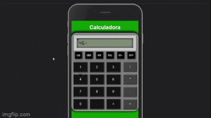
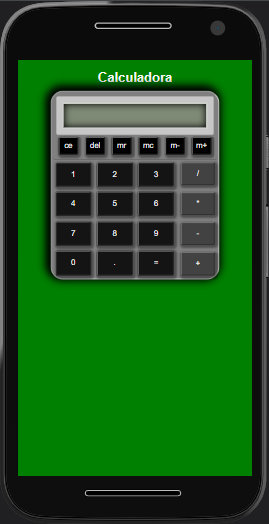
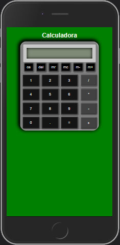

# Calculadora Expressão Numérica
Case de uma calculadora em Javascript que faz cálculos de expressões numéricas `(2+3*4-6/2...)` com função de memória e utilizando as quatro operações fundamentais da matemática:

## Índice
- [Índice]()
- [Links para projeto]()
- [Manual de operação]()
  - [Interação]()
  - [Padrão de parâmetros]()
  - [M+ M- MR MC - Memória secundária]()
    - [Feature]()
- [Bugs Conhecidos]()
- [Features à implementar]()
- [Responsividade]()
  - [MotoG4 360x640]()
  - [Iphone 6,7,8 375x667]()

## Links
- [Confira aqui para visualizar o projeto online, diretamente no seu navegador sem configurar nada! Famoso "deploy".](https://simple-case-study.vercel.app/app-calculadora/index.html)

- Clique no GIF abaixo para acessar o vídeo completo.

  

- [Link de outros "deploys" de projetos em Javascript](https://simple-case-study.vercel.app/)

- [Link para essa documentação](https://github.com/gabrieldeori/simple-case-study/tree/main/app-calculadora)

  https://github.com/gabrieldeori/simple-case-study/tree/main/app-calculadora

## Manual de operação
### Interação
Existem duas formas de interagir com a calculadora, pelos botões, ou pelo display:
  - Pelos botões basta clicar nos botões normalmente e escrever as expressões desejadas clicando em cada botão. No final clique no botão de igual `"="` para mostrar o resultado.

  - Você também pode clicar no display e digitar a expressão que deseja diretamente, porém deve se atentar e seguir o padrão de parâmetros da calculadora.

### Padrão de parâmetros
A calculadora irá aceitar as quatro operações fundamentais como aprendemos com o "Meu Sadruga", a soma `+`, subtração `-`, multiplicação `*` e divisão `/`.

Caso esteja usando os botões, você pode operar a calculadora normalmente clicando nos parâmetros, porém para digitar no input você deve seguir alguns padrões.

### M+ M- MR MC - Memória secundária
A calculadora vem com o conhecido sistema de memória secundária e é bem simples de utilizar.

M+ adiciona o atual valor que está sendo mostrado no display a memória.

- Memória secundária = ""
- Display = 20
- Aperta `M+`
- Display = 20
- Memória secundária = 0+20 = 20

M- subtrai o atual valor que está sendo mostrado no display da memória secundária.

- Memória secundária = 20
- Display = 5
- Aperta `M-`
- Display = 20
- memória secundária = 20 - 5 = 15

MR busca o valor na memória e o adiciona na tela principal:

- Memória secundária = 15
- Display = 5 + 
- Aperta `MR`
- Display = 5 + 15
- memória secundária = 15

MC Apaga o valor na memória secundária
- Memória secundária = 5
- Display = 5 + 15
- Aperta `MC`
- Display = 5 + 15
- memória secundária = ""

#### Feature
Ao fazer M+ é possível somar expressões a memória, por exemplo:

- Memória secundária = ""
- Display = 5 + 15 -
- Aperta `M+`
- Display = 5 + 15 -
- memória secundária = "5 + 15 -"

Continuando

- Memória secundária = "5 + 15 -"
- Display = 5 + 15 -
- Aperta `M+`
- Display = 5 + 15 -
- memória secundária = "5 + 15 - 5 + 15 -"

Assim é possível manter expressões numéricas completas gravadas na memória.

## Bugs conhecidos
- Ao usar o display da calculadora para inserir valores, não é filtrado valores inválidos, e o resultado normalmente é 0.

  ##### Ex: 1A + 2B = 0

  Correção: Adicionar a feature que permite filtrar os dados ao digitar na calculadora em tempo real e não permitir inserir valores inválidos.

- Ao utilizar o botão de ponto para adicionar casa decimal, a calculadora permite que se insira dois pontos de decimal em um número.

  ##### Ex: 1.2.222 é aceito

  Correção: Modificar regex que detecta ponto, ele não está detectando até onde é necessário.

## Features à implementar
- Melhorar a aparência do aplicativo.
- Implementar parênteses para priorizar cálculos.
- Implementar funções de porcentagem.
- Implementar raiz quadrada simples.
- Implementar outras funções de uma calculadora científica.
- Adicionar um histórico de cálculos.
- Melhorar a aparência do aplicativo novamente.
- Implementar resolução de equações e desenhar gráficos.
  

## Responsividade
O aplicativo funciona em resoluções bem baixas de mobiles antigos (180px x 260px) até resoluções altas como (3840px x 2160px) TV's 4k. 

Utilizei a técnica REM, alterando o tamanho da fonte na raiz.

Abaixo estão os previews em mobile:

### MotoG4 360x640

### Iphone 6,7,8 375x667

