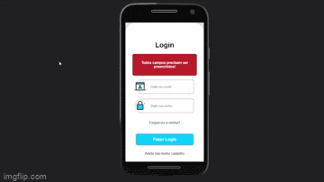
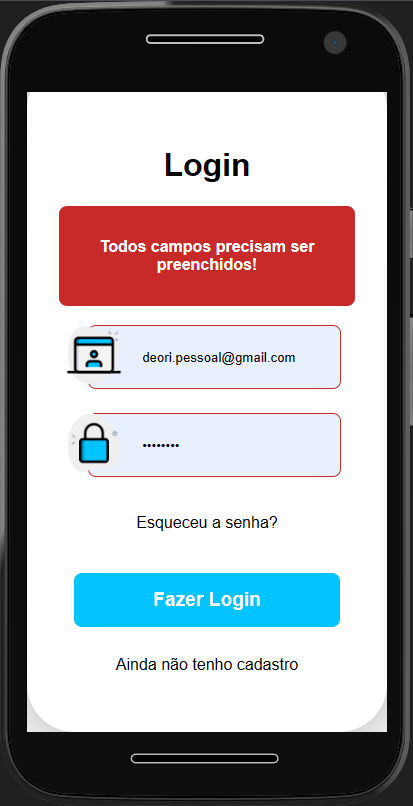

# PHP Crud de Login

## Índice

- [Índice]()
- [Links para projeto]()
- [Bugs Conhecidos]()
- [Features à implementar]()

  ## Links para projeto
  ###### Esse projeto não tem deploy, não achei necessário.

- Clique no GIF abaixo para acessar o vídeo completo.

  

- [Link para essa documentação](https://github.com/gabrieldeori/simple-case-study/tree/main/login)

  https://github.com/gabrieldeori/simple-case-study/tree/main/login

## Bugs conhecidos
- Ainda não está implementando 100% a validação por email, o código está pronto mas a configuração não.

## Features à implementar
- Resolver configuração do email
- Melhorar a aparência do aplicativo
- Melhor responsividade

## Responsividade
O aplicativo funciona em resoluções bem baixas de mobiles antigos (180px x 260px) até resoluções altas como (3840px x 2160px) TV's 4k. 

Utilizei a técnica REM, alterando o tamanho da fonte na raiz.

Abaixo estão os previews em mobile:

### MotoG4 360x640

