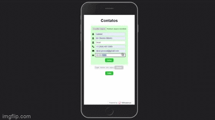
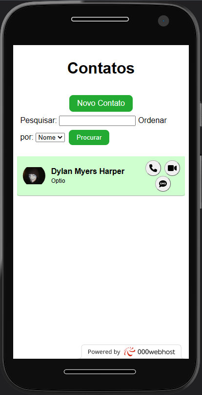

# Agenda em PHP
Agenda em PHP tem por objetivo a primeira prática em PHP.
Essa agenda foi inspirado no aplicativo "Contatos" do meu smartphone (Infinix Hot 11s).

## Índice

- [Índice]()
- [Links para projeto]()
- [Bugs Conhecidos]()
- [Features à implementar]()
- [Responsividade]()
  - [MotoG4 360x640]()
  - [Iphone 6,7,8 375x667]()

  ## Links para projeto

- [Confira aqui para visualizar o projeto online, diretamente no seu navegador sem configurar nada! Famoso "deploy".](https://deori-server-lost-brazil.000webhostapp.com/php-agenda/index.php)
###### Esse projeto tem pequenas diferenças do projeto original que foram necessárias para que fosse disponível colocá-lo online.

- Clique no GIF abaixo para acessar o vídeo completo.

  

- [Link para essa documentação](https://github.com/gabrieldeori/simple-case-study/tree/main/php-agenda/)

  https://github.com/gabrieldeori/simple-case-study/tree/main/php-agenda/

## Bugs conhecidos
- As fotos ainda não estão sendo deletadas da pasta public ao se trocar uma foto
- Não aparece um preview da atual foto ao selecioná-la na edição ou cadastramento

## Features à implementar
- Resolver o preview da atual foto ao selecionada na edição ou cadastramento
- Resolver o bug das fotos não estarem sendo deletadas
- Remover metadados das fotos para melhorar privacidade
- Melhorar a aparência do aplicativo
- Implementar scroll pelas letras iniciais

## Responsividade
O aplicativo funciona em resoluções bem baixas de mobiles antigos (180px x 260px) até resoluções altas como (3840px x 2160px) TV's 4k. 

Abaixo estão os previews em mobile:

### MotoG4 360x640

