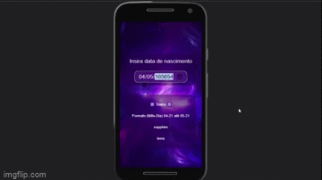
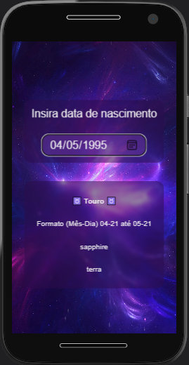

# Zodiac-Search
Signos | Poder dos astros é um projeto simples para definir um signo dos zodíaco baseado em uma data de nascimento com direito a estrelinhas passando pela sua tela para seu deleite `(treinar um pouco sobre canvas)`.

## Links
- [Confira aqui para visualizar o projeto online, diretamente no seu navegador sem configurar nada! Famoso "deploy".](https://simple-case-study.vercel.app/zodiac-search/index.html)

- [Clique abaixo para acessar o vídeo completo. ](https://youtu.be/ECaG_YBgoQs)

- [Link de outros "deploys" de projetos em Javascript](https://simple-case-study.vercel.app/)

- [Link para essa documentação](https://github.com/gabrieldeori/simple-case-study/tree/main/zodiac-search)

  https://github.com/gabrieldeori/simple-case-study/tree/main/zodiac-search

## Manual de operação
Basta inserir ou selecionar a data de aniversário desejada no campo de data e o signo irá aparecer automaticamente.

Não é necessário inserir o ano de nascimento, já que não é levado em conta para isso.

## Features à implementar
- Calendário de seleção de mês e dia personalizado
- Buscar o signo por nome
- Buscar o signo por símbolo
- Ampliar o banco de dados sobre o signo com mais textos sobre cada signo.

## Responsividade
O app funciona normalmente em aparelhos comuns de 360x640 e acima.

